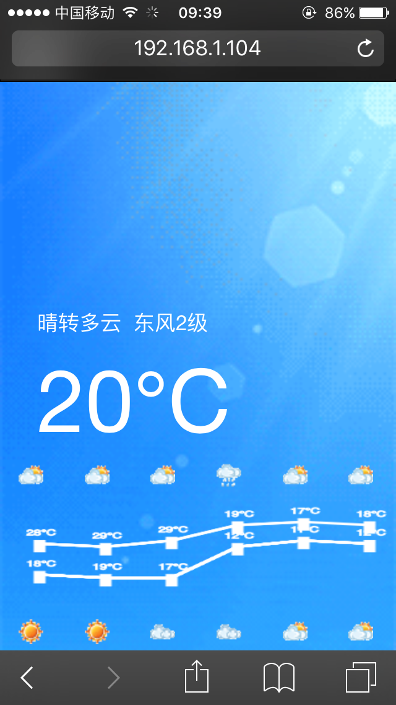
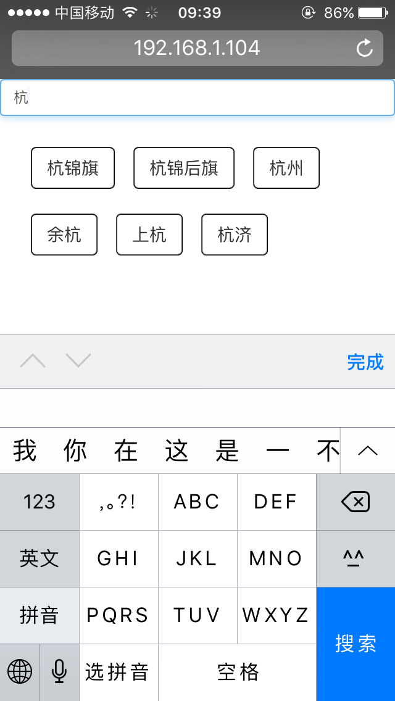
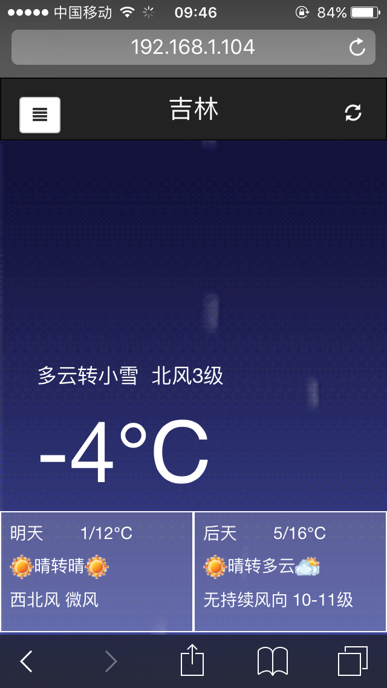
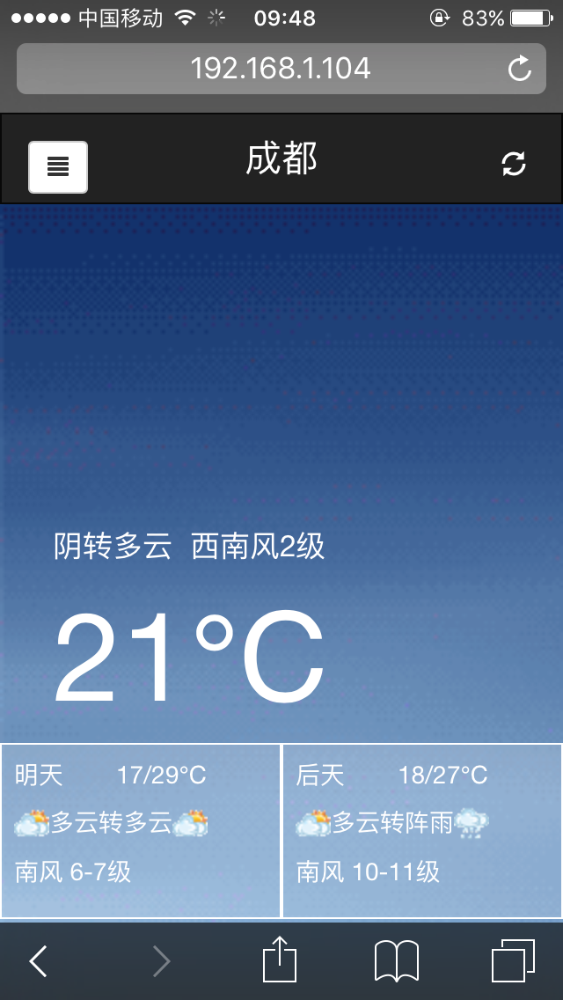
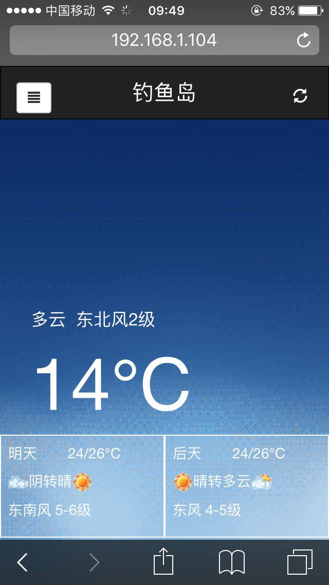

# Weather app based on React with redux

## 运行

		cd Weather/

		npm install

		npm start

​	
		open localhost:2000

## 简介

染陌天气，后端采用Node.js，前端采用react+redux。

感谢国家气象局天气接口， http://www.weather.com.cn/

感谢  http://goodbai.com/web/UseForecastAndPMDataAPI.html  博客指导天气api使用方法。

>    

